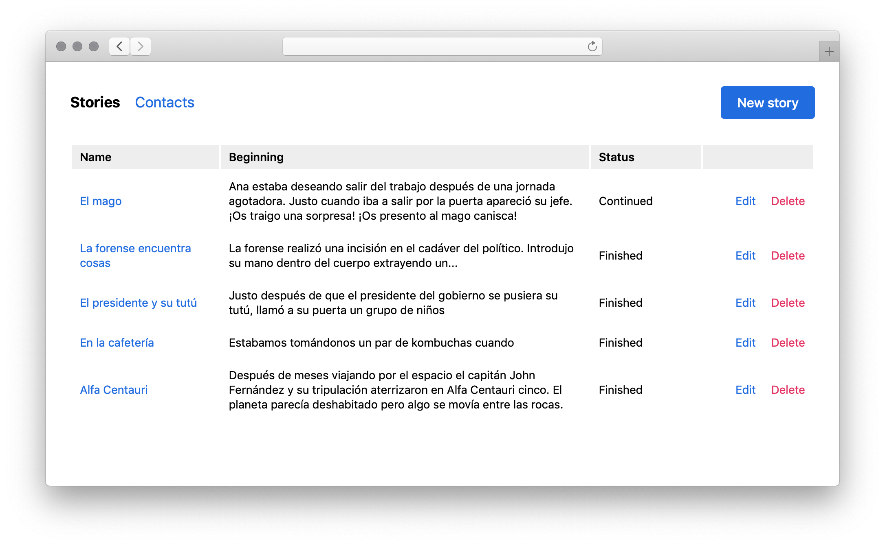

### Robophone

Like a party line but for making up stories with strangers. Using a short text as input calls a number of people using their transcribed reply as source for the next one. You end up with a story that is a little bit an exquisite cadaver and a little bit a broken telephone game, by telephone.

The project uses the [Twilio API](https://www.twilio.com/docs/usage/api) and [WebSockets](https://developer.mozilla.org/en-US/docs/Web/API/WebSockets_API) to send calls an receive transcripts. It's pretty cool to see the messages appear in the story page as people reply live.

[▶️ See how it works](https://github.com/marcelinollano/robocall/raw/master/doc/demo.mp4)

_This was presented live at [Poetry Slash II](https://poesia.javier.is), 27 Apr 2019. An event of [Libros Mutantes 2019](https://librosmutantes.com) book fair at [La casa encendida](https://www.lacasaencendida.es) (Madrid)._

#### Some stories (Spanish-only)

Here are some sample stories that we created using this:

##### El presidente y su tutú

> **Intro:** Justo después de que el presidente del gobierno se pusiera su tutú, llamó a su puerta un grupo de niños.
>
> **Person 1:** Los niños tenían huevitos de chocolate y le ofrecerán al presidente a ver si le gustaría participar en su obra de teatro de Pascua y el presidente estaba encantado porque llevaba toda la mañana y ensayando el baile
>
> **Person 2:** Sin embargo usted cuándo comenzó la representación el presidente tuvo un ataque de asma y fue incapaz de continuar bailando a terminar el día se fue a su habitación con un tutu en el armario y te juro no volver nunca más

##### En la cafetería

> **Intro:** Estabamos tomándonos un par de kombuchas cuando…
>
> **Person 1:** Cuando de pronto surgió de la nada un terrible monstruo y nos exigió tomar nota
>
> **Person 2:** Nota de lo que iba a pedir en la cafetería

#### How to install

To make this work you need [Ruby](https://ruby-lang.org), [SQLite](https://en.wikipedia.org/wiki/SQLite), a [Twilio account](https://twilio.com) and you also need to validate a phone number through their to make calls. For production deployment I included a [Dockerfile](Dockerfile).

To install on your machine run:

1. `bundle install` to install the rubygems
2. Copy `.env.sample -> .env` and edit the configuration
3. `foreman start` to run the app
4. Visit `http://localhost:5000`, voilà!

#### Other possible uses

Leaving aside the poetic nature of the project, it is basically an address book and a call scheduler with transcription. You could use this to automate calls or SMS messages.

You will have to remove my audios from the `views/twiml` folder because those are very specific and you are not allowed to use them (it's my voice). Then, most of the logic is inside the scripts that perform the calls. Those are `/bin/dial` that chains the calls and feeds the previous transcript to the next call and `/bin/sms` that sends the resulting story to all participants.

You can tweak all those files and find new uses for this. If you manage to do something cool with it, please let me know! Good luck!

–– marce
